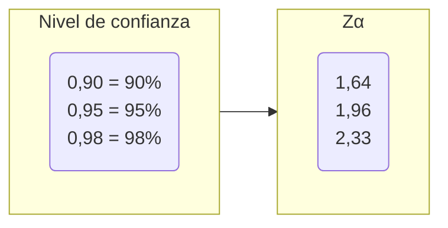

# Cálculo de tamaño de muestra 🔋

Determinar el tamaño de la muestra que se va a seleccionar es un paso importante en cualquier estudio de investigación de mercados, se debe justificar convenientemente de acuerdo al planteamiento del problema, la población, los objetivos y el propósito del estudio.

**Se definen los siguientes factores:**

## a) Nivel de confianza (1 - &alpha;)

Probabilidad deseada de que el parámetro a estimar se encuentre dentro de un margen esperado , los valores estadísticos son:

### Se elige nivel de confianza

## b) Margen de error deseado (*d*)

Error en la estimación que como máximo se espera obtener

## c) Proporción estimada (&rho;)

Proporción estimada del éxito de la variable que se desea medir

## Fórmulas del cálculo de tamaño de muestra

### a. Conociendo la población ✔

$$ n = \frac{N \cdot Z\alpha \cdot p \cdot q}{d^2 \cdot (N - 1) + Z\alpha^2 \cdot p \cdot q}$$

### b. Sin conocer la población ❌

$$ n = \frac{Z\alpha^2 \cdot p \cdot q}{d^2} $$

### c. Para una media ➖ cuando se conoce la población  ✔

$$ n = \frac{Z\alpha^2 \cdot \sigma^2 \cdot N}{E^2(N - 1) + Z\alpha^2 \cdot \sigma^2} $$

### d. Para una media ➖ cuando se desconoce la población ❌

$$ n = \frac{Z\alpha^2 \cdot \sigma^2}{E^2} $$

#### Variables para el cálculo de tamaño de muestra

- N = Tamaño de la población
- Z&alpha; = Nivel de confianza
- p = Probabilidad de éxito
- q = Probabilidad de fracaso
- d = Error máximo permisible en la estimación (Margen de error)
