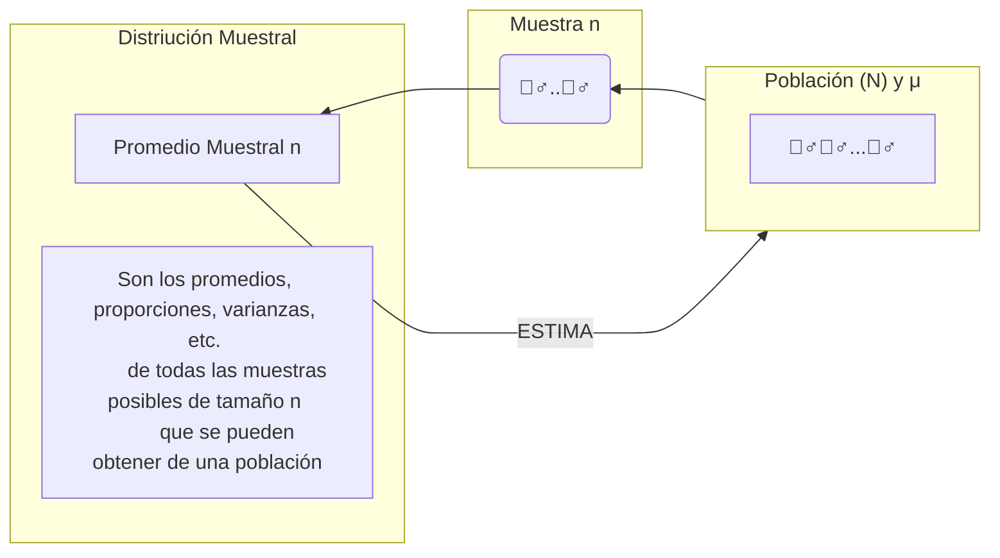
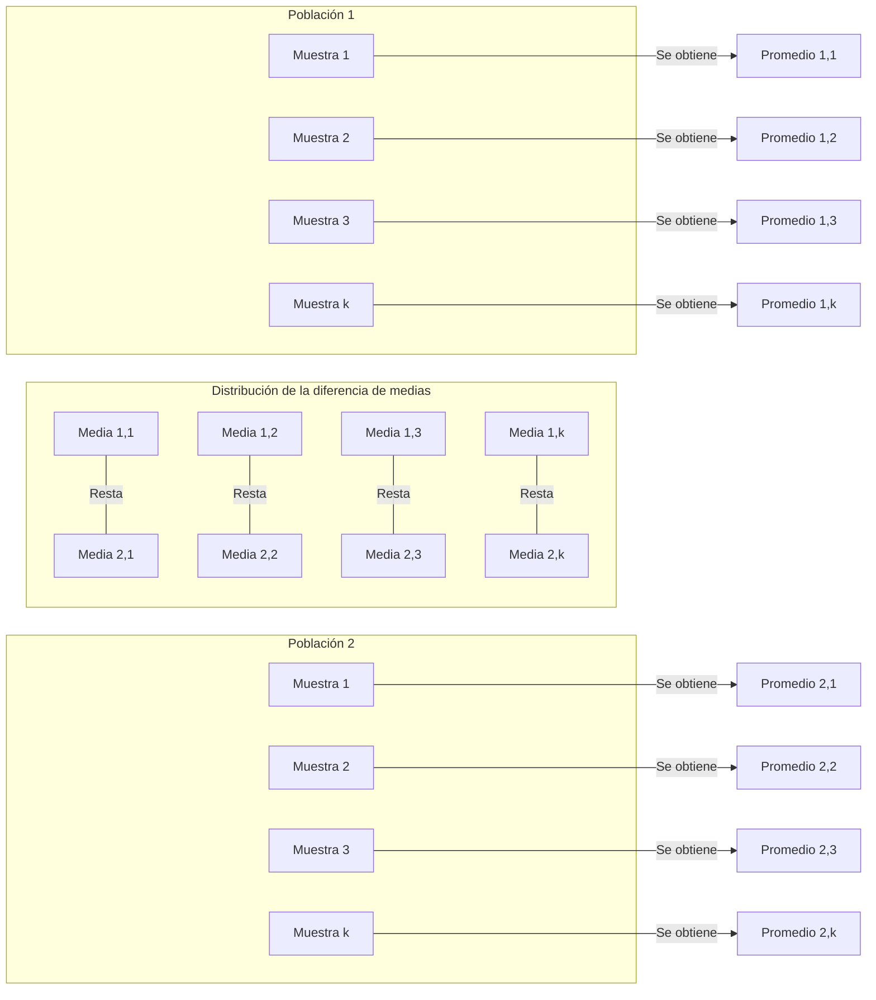
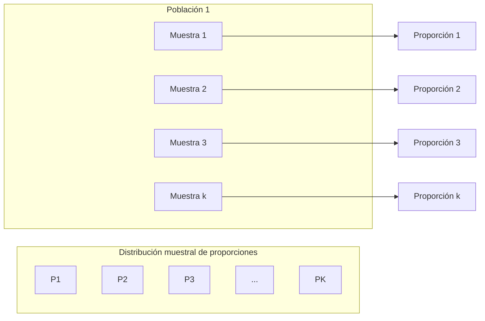

# Distribución Muestral

**Distribución**: Conjunto de datos la manera en la que están presentados varían según la distribución.

**e.g.** Estaturas, la forma en la que cambian los numeros, es llamada distribución.

**Distribución muestral**: Datos de varias muestras de una población **(como media, moda, mediana)**, mientras MÁS MUESTRAS, MÁS SEGURO QUE SERÁ DISTRIBUCIÓN NORMAL, confirmando la campana de Gauss. 👀

SI ESTUDIO LA MEDIA (&mu;) DE LA POBLACIÓN: [Parámetro](/lista-definiciones.md/#14-parámetro)

SI ESTUDIO LA MEDIA ($\tilde{x}$)DE LA MUESTRA: [ESTADÍSTICO o ESTIMADOR](/lista-definiciones.md/#15-estadístico)

- Teoria del muestreo estudia las **RELACIONES** entre la **POBLACIÓN** y las **MUESTRAS** extraídas de la misma
- Permite **ESTIMAR** cantidades **DESCONOCIDAS** de la población como la media poblacional, la varianza,etc. frecuentemente llamadas **PARÁMETROS POBLACIONALES** a partir de las correspondientes cantidades muestrales como son la media, la varianza y otros **estadísticos muestrales** o brevemente llamados **estadísticos**.
- La teoría de muestreo es útil para determinar por ejemplo: el aplicar un nuevo suero para el tratamiento de una enfermedad, o decidir si un proceso de producción es mejor que otro. Estas deciciones envuelven a los llamados **ensayos e hipótesis de significación**.
- En general, a todo lo mencionado anteriormente se le conoce como **INFERENCIA ESTADÍSTICA**.
- De la población se extraen muestras de tamaño n, se calcula el estadístico de interés y se construye una distribución muestral de ese estadístico.
-La muestra puede tomar diferentes valores, pero el estadístico de interés es el mismo. Entonces es mejor hacer que varíen lo menos posible el tamaño de muestra.

*Véase también [Relación población-muestra](/lista-definiciones.md/#relación-población-muestra)*.

**e.g.** Tenemos a la población de 2500 empleados y varias de muestras cada una de 30.

- Población $N$

$N = 2500$

| Empleado | Salario |
| -------- | ------- |
| 1        | $       |
| 2        | $       |
| 3        | $       |
| ...      | ...     |
| 2500     | $       |

$\mu = \$1200$

- Muestra: $n_{1}$

$n_{1} = 30$

| Empleado | Salario |
| -------- | ------- |
| 1        | $       |
| 2        | $       |
| 3        | $       |
| ...      | ...     |
| 30       | $       |

$\tilde{x}_{1} = \$13334$

- Muestra: $n_{2}$

$n_{2} = 30$

| Empleado | Salario |
| -------- | ------- |
| 1        | $       |
| 2        | $       |
| 3        | $       |
| ...      | ...     |
| 30       | $       |

$\tilde{x}_{2} = \$11484$

- Muestra: $n_{3}$

$n_{k} = 30$

| Empleado | Salario |
| -------- | ------- |
| 1        | $       |
| 2        | $       |
| 3        | $       |
| ...      | ...     |
| 30       | $       |

$\tilde{x}_{k} = \$12500$

- Donde $k=500$
- Tabla de valores de 500 muestras, de tamaño $n=500$

| No. de muestras | Media muestral ($\tilde{x}$)  |
| --------------- | ----------------------------- |
| 1               | $\tilde{x}_{1}$ = $\$13354$   |
| 2               | $\tilde{x}_{2}$ = $\$11484$   |
| 3               | $\tilde{x}_{3}$ = $\$11138$   |
| ...             | ...                           |
| 500             | $\tilde{x}_{500}$ = $\$12500$ |

$$ \frac{\sum\tilde{x}_{i}}{500} \approx \mu  $$

Si en vez de 500 muestras tomamos todas las muestras posibles.

**Obtendríamos:** Valor estimado = media poblacional

$$ E(\tilde{x}) = \mu  $$

## Propiedades de la distribución muestral de la media muestral x̄

**Donde la media y la desviación estándar:**

🎪 La media (&mu;) y la [desviación típica](./lista-definiciones.md/#desviación-estándar) (&sigma;) de la **población**.

🏠 La media (&mu;$_{\tilde{x}}$) y la [desviación típica](./lista-definiciones.md/#desviación-estándar) (&sigma;$_{\tilde{x}}$) de la distribución **muestral**.

Casos según la distribución de la población: Donde $X$ son los datos.

### Distribución Estándar de la Muestra (n) y Población (N)

La población se aproxima a una distribución normal, la media muestral se distribuye normalmente para cualquier tamaño de muestra.

Muestra: $X \sim  n(\mu, \frac{\sigma}{\sqrt{n}})$

Población: $X \sim N(\mu, \sigma²)$

#### Caso 1: Población con Distribución **[NORMAL](./lista-definiciones.md/#curva-normal)**

$X \sim N(\mu, \sigma^2)$

Si la muestra aleatoria $X_{1}, ..., X_{n}$ Tiene distribución normal con **media &mu;** y **desviación típica &sigma;**:

Para cualquier tamaño de muestra ($n$):

La media muestral ($\tilde{x}$) también tiene una distribución normal con media $\mu_{\tilde{x}} = \mu$ y [desviación típica](./lista-definiciones.md/#desviación-estándar): $\sigma_{\tilde{x}} = \frac{\sigma}{\sqrt{n}}$

**Notación estadística** &rightarrow; Si: $X \sim n(\mu, \frac{\sigma}{\sqrt{n}}) \rightarrow X \sim N(\mu, \frac{\sigma}{\sqrt{n}})$

#### Caso 2: Población con distribución **NO NORMAL**

$X \sim ??(\mu, \sigma^2)$

**Teorema del [límite central](/lista-definiciones.md/#teorema-de-límite-central)**

Si la muestra seleccionada tiene un tamaño **MAYOR O IGUAL** a **30**, sea cual sea la forma de la distribución de la población **(SEA NORMAL O NO)**, las medias de todas las muestras seleccionadas de la población tendrán una distribución normal.

## Recapitulando 🔃

### a) Valor esperado

Para el muestreo aleatorio simple. Donde $E$ es el **valor esperado** $E(\tilde{x}) = \mu$

**e.g.** Sabemos que &mu; = \$12,2111, entonces E($\tilde{x}$) = \$12,2111

### b) Desviación Estándar

#### Población finita

$$ \sigma_{\tilde{x}} = \sqrt{\frac{N - n}{N - 1}} \cdot (\frac{\sigma^2}{n}) $$

#### Población infinita

Si no ❌ dan datos de la población, entonces se asume que es infinita. ✔

$$ \sigma_{\tilde{x}} = \frac{\sigma}{\sqrt{n}} $$

#### Curiosidad 👀❓

Si la población es finita pero la división entre la muestra y la población es menor o igual a 0,05; se usa la fómula de la [Población infinita](#población-infinita)

$$ \frac{n}{N} \le 0,05 $$

**e.g.** Sabemos que $\sigma = \$1,500$, entonces $\sigma_{\tilde{x}} = \$1,500$

$\sigma = 4480.42$
$N = 2500$
$n = 30$

$$ \frac{n}{N} = 30/2500 = 0,012 $$

$$ \sigma_{\tilde{x}} = \frac{4480.42}{\sqrt{30}} = 818.01 $$

**e.g.** Sabemos que $\sigma = \$1,500$, entonces $\sigma_{\tilde{x}} = \$1,500$

$\sigma = 4480.42$
$N = 2500$
$n = 30$

$$ \frac{n}{N} = 30/2500 = 0,012 $$

$$ \sigma_{\tilde{x}} = \frac{4480.42}{\sqrt{30}} = 818.01 $$

### c) Forma de la distribución (población &equiv; p)

#### Para una población desconocida

La distribución de la media de la muestra $\tilde{x}$ se puede aproximar con una distribución normal de probabilidades cuando el tamaño de la muestra es grande. Mayor o igual a 30.

$$ n \ge 30 $$

#### Para una [Población normal](./lista-definiciones.md/#población-normal), sin importar el tamaño de la muestra

La distribución muestral de $\tilde{x}$ es **[NORMAL](/lista-definiciones.md/#curva-normal)** para cualquier tamaño de la muestra.

### En resumen 🥣

Si $n \ge 30$, entonces $\tilde{x}$ se distribuye normalmente.

Si $n < 30$, entonces $\tilde{x}$ se distribuye normalmente *si la población es normal*

Si $n$ con una [M.A.S](/lista-definiciones.md/#311-muestreo-aleatorio-simple) de muestra mayor o igual a 30 y aplicando el [Teorema del Límite Central](/lista-definiciones.md/#teorema-de-límite-central), la distribución muestral de $\tilde{x}$ es normal con &mu; y &sigma;$_{\tilde{x}} = \frac{\sigma}{\sqrt{n}}$

Véase el ejemplo en [Teorema del Límite Central](/lista-definiciones.md/#teorema-de-límite-central)

Supóngase que son extraídas de una [Población Infinita](#población-infinita) todas las posibles [muestras](/lista-definiciones.md/#13-muestra) **sin reemplazo** de tamaño $n$.

**Si se denota:**

Vésase [distribución estándar](/apuntes-estadistica-inferencial/lista-definiciones.md/#desviación-estándar) de la [muestra](#propiedades-de-la-distribución-muestral-de-la-media-muestral-x̄) y [población](#propiedades-de-la-distribución-muestral-de-la-media-muestral-x̄)

- La [distribución muestral](/apuntes-estadistica-inferencial/distribucion-muestral.md/#distribución-muestral) de las medias cumplen la siguiente igualdad:

- La media de la muestra va a ser igual a la media de la población cuando más muestras se tenga:

$$ \mu_{\tilde{x}} = \mu $$

- La desviación estándar de la muestra
- n = cantidad de elementos de la muestra

$$ \sigma_{\tilde{x}} = \frac{\sigma}{\sqrt{n}} $$

## Distribución muestral de medias con VARIANZA CONOCIDA (población)

> Distribución Normal

*Véase nuevamente [Distribución Muestral](#distribución-muestral) y [Prueba de Normalidad](/apuntes-estadistica-inferencial/prueba-de-normalidad.md).*

**Distribución muestral de medias con varianza conocida**:

Sabemos que si de una muestra aleatoria ($x_{1}, x_{2}, ..., x_{n}$) de tamaño n, procedente de una **población normal N(&mu;, &sigma;²)**; entonces la distribución de la media muestral tendrá una distribución normal para cualquier tamaño.

Si los datos tienden a una distribución normal, entonces la media de la muestra será normal, definida con la misma media poblacional.

Si: **X** $\sim N(\mu, \sigma^2)$ &rightarrow; $\tilde{X} \sim n(\mu; \frac{\sigma}{\sqrt{n}})$

Si se desconoce que **X** tiende a una distribución normal (no es campana de Gauss), entonces se aplica el teorema del límite central ([TLC](/lista-definiciones.md/#teorema-de-límite-central)).

Que dice que si los datos no cumplen una distribución normal. Se necesita 30 o más datos. Entonces la media de la muestra se distribuye normalmente.

**Si: X** $\sim ??(\mu, \sigma^2)$ **[TLC](/lista-definiciones.md/#teorema-de-límite-central) si n &le; 30** &rightarrow; $\tilde{X} \sim n(\mu; \frac{\sigma}{\sqrt{n}})$

Para los ejercicios, como los valores no están estandarizados, se deben estandarizar como a continuación:

&rightarrow; **ESTANDARIZACIÓN:** $Z = \frac{\tilde{X}-\mu}{\frac{\sigma}{\sqrt{n}}} \sim N(0,1)$

Donde:

- **X**: Datos de la población (variables aleatorias)
- **$\tilde{X}$**: Datos de la muestra (variables aleatorias)
- &sim; : Se aproxima a una distribución normal
- $\frac{\sigma}{\sqrt{n}}$: Error estándar de la media muestral
- **$n$**: Media de la muestra
- **$\mu$**: Media poblacional

## Distribución mustral de medias con VARIANZA DESCONOCIDA (población)

> Distribución T-Stundent

**Condiciones:**

- Se utiliza en muestras pequeñas de **menos de 30** elementos.
- La desviación estándar de la población **(&sigma;)** no se conoce.
- Distribución Población tiene que ser normal

**Características:**

- Es simétrica, cada curva **T** tiene forma de [campana](/apuntes-estadistica-inferencial/lista-definiciones.md/#campana-de-gauss) con centro en 0.
- Las áreas de los extremos, las cuales son más amplias que la distribución normal, como consecuencia de que *usualmente se trabala con muestras pequeñas.*
- Tiene grados de libertad (g.l): $V = n — 1$ , cuando $V \rightarrow \infin$ la curva T se aproxima a la Normal.

## Distribución de la diferencia de dos medias muestrales con VARIANZA POBLACIONAL CONOCIDA (muestra)

> Distribución Normal: Z calculado

Sean $(\tilde{X}_{11}, \tilde{X}_{12}, ..., \tilde{X}_{1k})$ y $(\tilde{X}_{21}, \tilde{X}_{22}, ..., \tilde{X}_{2k})$ dos muestras aleatorias simples e independientes de tamaños $n_{1}$ y $n_{2}$ procedentes de $N(\mu_{1x}, \sigma_{2x})$, (extraídas de dos poblaciones normales independientes con medias $\mu_{1}$ y $\mu_{2}$ y varianzas $\sigma_{1}^2$ y $\sigma_{2}^2$ respectivamente). Entonces la distribución muestral de la diferencia de medias se distribuye:

$$ \tilde{X}_{1} - \tilde{X}_{2} \sim N(\mu_{1} - \mu_{2}, \sqrt{\frac{\sigma_1^2}{n_1}+\frac{\sigma_2^2}{n_2}}) $$

**Estandarización ⚠:**

$$ Z_c = \frac{(\tilde{X}_1-\tilde{X}_2)-(\mu_1-\mu_2)}{\sqrt{\frac{\sigma_1^2}{n_1}+\frac{\sigma_2^2}{n_2}}} \sim N(0,1)$$

## Distrbución de la diferencia de dos medias muestrales con VARIANZA POBLACIONAL DESCONOCIDA (muestra)

> Distribución T-Student

Se sabe que:

$$ X_1 \sim n(\mu_1, ?) \rightarrow n_1 $$

$$ X_2 \sim n(\mu_2, ?) \rightarrow n_2 $$

### Caso a ⚠: Las varianzas poblacionales son desconocidas pero iguales

$$ \sigma^2_1=\sigma^2_2=\sigma^2 $$

$$ T=\frac{(\tilde{X}_1-\tilde{X}_2)-(\mu_1-\mu_2)}{\sqrt{S_p^2\cdot(\frac{1}{n_1}+\frac{1}{n_2})}} \sim t_{n_1+n_{2-2}} $$

> Tiene una distribución de T-Student con grados de libertad: $n_1+n_{2-2}$

**Donde:**

- $t$ = Grados de libertad

- $S_p^2$ = Varianza conjunta de las muestras

$$ S_p^2=\frac{(n_1-1) \cdot S_1^2+(n_2-1) \cdot S_2^2}{n_1+n_2-2} $$

### Caso b ⚠: Las varianzas poblacionales son desconocidas y diferentes

$$ \sigma^2_1 \neq \sigma^2_2 $$

$$ T=\frac{(\tilde{X}_1-\tilde{X}_2)-(\mu_1-\mu_2)}{\sqrt{\frac{S_1^2}{n_1}+\frac{S_2^2}{n_2}}} \sim t_{v} $$

> Tiene una distribución de T-Student con grados de libertad: $v$

**Donde:**

- $v$ = Grados de libertad

$$ v=\frac{(\frac{S_1^2}{n_1}+\frac{S_2^2}{n_2})^2}{\frac{(\frac{S_1^2}{n_1})^2}{n_1-1}+\frac{(\frac{S_2^2}{n_2})^2}{n_2-1}} $$

## Distribución Muestral de la proporción

$$ P \sim N(\pi,\sqrt{\frac{\pi\cdot(1-\pi)}{n}}) $$

- Una proporción se distribuye normalmente con media $\pi$ y desviación estándar $\sqrt{\frac{\pi\cdot(1-\pi)}{n}}$

**Donde:**

- $\pi$ = Proporción de la población
- $n$ = Tamaño de la muestra

Una *distribución binomial* está estrechamente relacionada con la **distribución muestral de proporciones**; pues una *población binomial es una colección de éxitos ó fracasos*, mientras que una **distribución muestral de proporciones** contiene **las proporciones de todos los números posibles de éxitos** en un experimnto binomial.

Para tamaños de muestra **mayores a 30** por el teorema del límite central se puede asegurar que la proporción muestral, $P$, tiene una distribución normal con media $\mu=\pi$ y Desviación estándar $\sigma=\sqrt{\frac{\pi\cdot(1-\pi)}{n}}$, es decir: $P \sim N(\pi, \frac{\pi\cdot(1-\pi)}{n})$

**Estandarización:**

$$ Z=\frac{p-\pi}{\sqrt{\frac{\pi\cdot(1-\pi)}{n}}} $$
