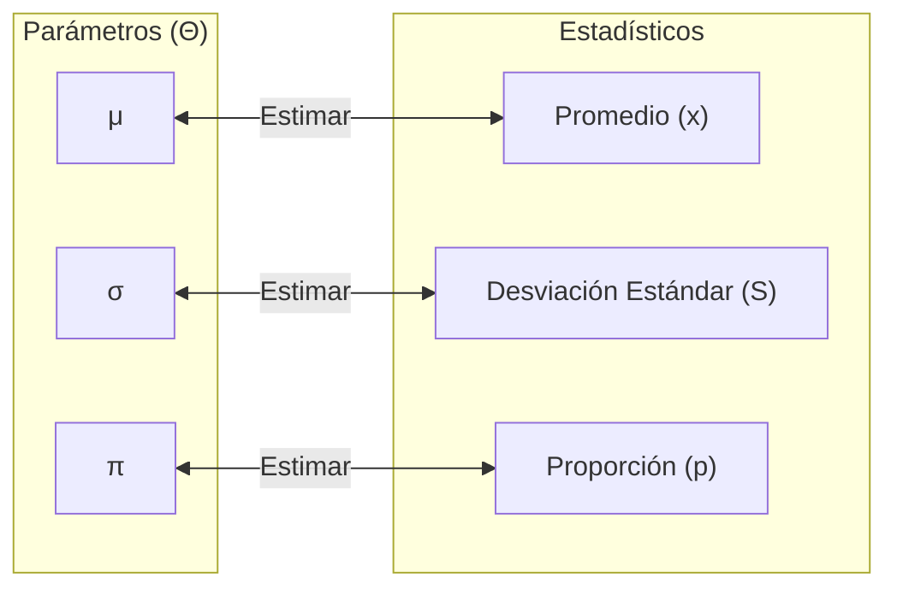

# Estimación

Se trata de emplear los [estadísticos](/apuntes-estadistica-inferencial/lista-definiciones.md/#15-estadístico) para [**estimar los parámetros**](/apuntes-estadistica-inferencial/lista-definiciones.md/#14-parámetro).

## Métodos de estimación

### Estimación Puntual

Utilización de **datos de la muestra para calcular solo un número**, para estimar parámetro de interés.

$$ \hat{\Theta} $$

### Estimación de intervalo

Ofrece un intervalo de valores razonables dentro del cual se pretende que esté el parámetro de interés: $\theta(\mu, \sigma, \pi)$. **Con cierto grado o de nivel de confianza 👀**.

$$ (\hat{\Theta}-a, \hat{\Theta}+a)$$

**No olvidar:**

### Estimador puntual

Es un estadístico que se usa para estimar un parámetro.

De la población de estaturas de los estudiantes en La UTP año 2017, se extrae una muestra aleatoria de 8 alumnos, cuyos valores observados son:

`1.50 1.6 1.58 1.45 1.52 1.68 1.62 1.55 .`

Halle un estimador puntual para la media poblacional.

Solución:

$$ \hat{\mu}=\tilde{X}=\frac{\sum_{i=1}^{n}X_i}{n}=\frac{1.5 + 1.6 + 1.58 + 1.45 + 1.52 + 1.68 + 1.62 + 1.55}{8} = 1.56m$$

- Donde:
- $\hat{\mu}$: Estimador puntual para la media poblacional.
- $\tilde{X}$: Media aritmética de la muestra.
- $n$: Tamaño de la muestra.
- $X_i$: Valor observado de la variable en la i-ésima observación.

✔ Cuando obtenemos una media aritmética a partir de una muestra (estadístico), esta puede ser empleada como estimador puntual para el valor de la media poblacional (parámetro). Análogamente con los demás estadísticos.

### Estimación por intervalos

En lugar de indicar simplemente un único valor como estimación del parámetro poblacional &Theta;(&mu;, &sigma;, &pi;), lo que se hace es calcular un **intervalo de valores** en el que *se tiene cierta probabilidad (confianza)* de que se encuentre el verdadero valor de &Theta; (parámetro).

$$ P(\hat{\Theta}-\epsilon<\Theta<\hat{\Theta}+\epsilon)=1-a $$

Donde:

- &Theta;: Valor a estimar.
- $\hat{\Theta}$: Estimador puntual hallado.
- $\epsilon$: Error de estimación (que se puede cometer).
- $a$: Error que cometemos.
- $1-a$: **Coeficiente grado de confianza**
- $\hat{\Theta}-\epsilon<\Theta<\hat{\Theta}+\epsilon$: Intervalo de confianza.

Es decir, se puede garantizar con una probabilidad de $1-a$ que la muestra elegida contendrá el valor verdadero &Theta;(&mu;, &sigma;, &pi;).

## Intervalo de confianza de la MEDIA con VARIANZA CONOCIDA

> Nota: En este caso se emplea la distribución normal estándar.

### LA CONFIANZA O NIVEL DE CONFIANZA (1 - &alpha;)

Es la probabilidad asumida de que la media &mu; este
contenida en el intervalo de confianza buscado en el
experimento: $1-99\%, 98\%, 95\%, 90\%...$

### LA DESCONFIANZA o NIVEL DE SIGNIFICANCIA (&alpha;)

Es lo raro que pude ocurrir en su experimento, es decir, hechos fortuitos o extraños: $\alpha=2\%, 5\%, 10\%, ...$

> Nota: El nivel de significación es también llamado el error Tipo I.

### Emplearemos Z cuando

- $n\ge30$ y $\sigma^2$ es conocida.
- $n<30$ y $\sigma^2$ es conocida.

#### 1.INTERVALO DE CONFIANZA(IC)

$$ IC=\left(\bar{X}-Z_{1-\alpha/2}\frac{\sigma}{\sqrt{n}} \le \mu \le \bar{X}+Z_{1-\alpha/2}\frac{\sigma}{\sqrt{n}}\right)$$

#### 2. ERROR(&epsilon;)

$$ |\bar{X}-\mu| \le \frac{Z_{1-\alpha/2} \cdot \sigma}{\sqrt{n}} $$

## Intervalo de confianza de la MEDIA con VARIANZA DESCONOCIDA

> Nota: En este caso se emplea la distribución t de Student.

### Caso a ⚠: Emplearemos T cuando: n<30 y &sigma;² DESCONOCIDA

- Cuando la varianza poblacional no es conocida utilizamos la distribución de **"t" de "student'**, para tamaños de muestra $n<30$. El estadístico T será:
  - Como &sigma;² no se conoce se estima mediante $S^2$.
  - La distribución se desvía en forma apreciable cuando los **grados de libertad $(v = n-1)$** son pequeños.
  - El estadístico $t$ definido resulta de una muestra aleatoria seleccionada de una población normal, con varianza &sigma;² no conocida.

$$ IC=\left(\bar{X}-T_{1-\alpha/2, gl}\frac{S}{\sqrt{n}} \le \mu \le \bar{X}+T_{1-\alpha/2, gl}\frac{S}{\sqrt{n}}\right)$$

$$ gl = n-1 $$

**Donde:**

- n: Tamaño de la muestra.

### Caso b ⚠: Emplearemos Z cuando: n>30 y &sigma;² DESCONOCIDA

## Fórmulas para el cálculo del intervalo de confianza (IC)

**Caso 1:**

Emplearemos $Z$ cuando: $n \ge 30$ y &sigma;² **CONOCIDA**

$$ IC: \left(\bar{X}-Z_{1-\alpha/2}\frac{\sigma}{\sqrt{n}} \le \mu \le \bar{X}+Z_{1-\alpha/2}\frac{\sigma}{\sqrt{n}}\right) $$

$$ \epsilon: |\bar{X}-\mu| \le \frac{Z_{1-\alpha/2} \cdot \sigma}{\sqrt{n}} $$

**Caso 2:**

Emplearemos $T$ cuando: $n < 30$ y &sigma;² **DESCONOCIDA**

$$ IC: \left(\bar{X}-T_{1-\alpha/2, gl}\frac{S}{\sqrt{n}} \le \mu \le \bar{X}+T_{1-\alpha/2, gl}\frac{S}{\sqrt{n}}\right) $$

$$ \epsilon: |\bar{X}-\mu| \le \frac{T_{1-\alpha/2, gl} \cdot S}{\sqrt{n}} $$

$$ gl = n-1 $$

**Caso 3:**

Emplearemos $Z$ cuando: $n \ge 30$ y &sigma;² **DESCONOCIDA**

$$ IC: \left(\bar{X}-Z_{1-\alpha/2}\frac{S}{\sqrt{n}} \le \mu \le \bar{X}+Z_{1-\alpha/2}\frac{S}{\sqrt{n}}\right) $$

**Caso 4:**

Emplearemos $Z$ cuando: $n < 30$ y &sigma;² **CONOCIDA**

$$ IC: \left(\bar{X}-Z_{1-\alpha/2}\frac{\sigma}{\sqrt{n}} \le \mu \le \bar{X}+Z_{1-\alpha/2}\frac{\sigma}{\sqrt{n}}\right) $$

## Intervalo de confianza para LA DIFERENCIA DE MEDIAS MUESTRALES  con VARIANZA POBLACIONAL CONOCIDA

Si $\bar{X}_1-\bar{X}_2$ son las medias de dos muestras aleatorias independientes de tamaño $n_1-n_2$, tomadas de poblaciones que tienen varianzas conocidas $\sigma_1^2, \sigma_2^2$, respectivamente, entonces el intervalo de confianza para $\mu_1-\mu_2$ es:

$$ IC: \left((\bar{X}_1-\bar{X}_2)-Z_{1-\alpha/2}\sqrt{\frac{\sigma_1^2}{n_1}+\frac{\sigma_2^2}{n_2}} \le \mu_1-\mu_2 \le \bar{X}_1-\bar{X}_2+Z_{1-\alpha/2}\sqrt{\frac{\sigma_1^2}{n_1}+\frac{\sigma_2^2}{n_2}}\right) $$

- Equivalente a:

$$ IC_{\mu_1-\mu_2} = \left[\bar{X}_1-\bar{X}_2 \pm Z_{1-\alpha/2} \cdot \sqrt{\frac{\sigma_1^2}{n_1}+\frac{\sigma_2^2}{n_2}} \right] $$

### Usamos Z (distribución normal estándar) cuando

1. Son muestras grandes $(n_1\ge30, n_2\ge30)$ VARIANZAS POBLACIONALES CONOCIDAS: $\sigma_1^2, \sigma_2^2$.Poblaciones normales o no.
2. Muestras pequeñas $(n_1<30, n_2<30)$ VARIANZAS POBLACIONALES CONOCIDAS: $\sigma_1^2, \sigma_2^2$. *Poblaciones normales*.

### Interpretaciones adicionales según los intervalos de confianza obtenidos

Si $IC=(+,+), P(+<\mu_1-\mu_2<+)=1-\alpha \rightarrow \mu_A > \mu_B$

Si $IC=(-,-), P(-<\mu_1-\mu_2<-)=1-\alpha \rightarrow \mu_A < \mu_B$

Si $IC=(-,+), P(-<\mu_1-\mu_2<+)=1-\alpha \rightarrow \mu_A = \mu_B$ (Las medias de $\mu_1 - \mu_2$ son iguales)

## Intervalo de confianza para la DIFERENCIA DE MEDIAS MUESTRALES con VARIANZA POBLACIONAL DESCONOCIDA

Varianza desconocida

- Muestras pequeñas $(n_1<30, n_2<30)$
- Varianzas poblacionales desconocidas e iguales: ($\sigma_1^2 = \sigma_2^2$).
- *Poblaciones normales*.

**Caso 1:**

$$ IC: \left((\bar{X}_1-\bar{X}_2)-T_{1-\alpha/2, gl}\sqrt{S_p^2 \cdot \frac{1}{n_1}+\frac{1}{n_2}} \le \mu_1-\mu_2 \le (\bar{X}_1-\bar{X}_2)+T_{1-\alpha/2, gl}\sqrt{S_p^2 \cdot\frac{1}{n_1}+\frac{1}{n_2}}\right) $$

Cuya distribución es la de **t de Student** con $gl = n_1 + n_2 - 2$.

$$ S_p^2 = \frac{(n_1-1) \cdot S_1^2 + (n_2-1) \cdot S_2^2}{n_1+n_2-2} $$
