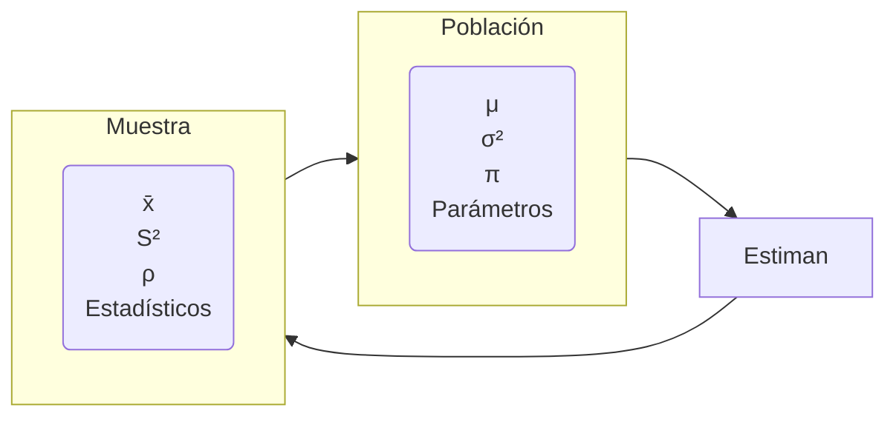
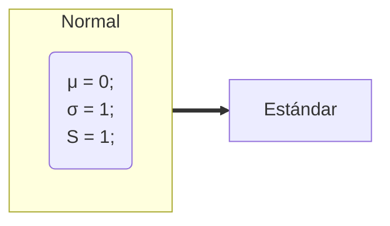

# Estadística inferencial

Inferir parámetros estadísticos de la población, a partir de los estadísticos de una muestra

## 0. Lista de definiciones

### Campana de Gauss

Es una curva simétrica, en forma de campana, que se obtiene al graficar una distribución normal.

Es cuando los datos se distribuyen normalmente.

### Valor Nominal

Es el promedio

### Gráficas

Para cada tipo de variable hay una tabla.

**e.g. Variables cualitativas** (porcentajes de hombres y mujeres), se realiza con diagrama de barras.
**e.g. Variables cualitativas nominal u ordinal** para diagrama de torta.

**e.g. Variables cuantitativas continuas o discretas** usan un diagrama llamado histograma. Que es parecido al de barras pero para datos que están en tabla y están agrupados (intervalos); en el eje de abscisas o $x$ van los intervalos y en la ordenada o $y$ las frecuencias. Al unirse los puntos medios de cada barra, se forma un polígono llamada **polígono de frecuencias**, cuyo área que tenga va a representar a la población o muestra. Es a partir de este polígono, se genera la **campana de Gauss**.

### Teorema de límite central

El teorema del límite central establece que, si se toman todas las muestras posibles de tamaño $n$ de una población, la distribución de las medias muestrales será una distribución normal con media igual a la media poblacional y desviación estándar igual a la desviación estándar poblacional dividida por la raíz cuadrada del tamaño de la muestra.

**e.g.** Vamos a ver la estatura de personas menores de 30 años, estatura entre 30-50 y mayores de 50. Al hacer la gráfica los jóvenes tiendes a ir a la **izquierda**, los de 30-50 al **centro** y los mayores de 50 a la **derecha**. Al hacer la gráfica de la media de cada grupo, se ve que se distribuyen normalmente.

Cuanto más datos (información) halla, sea la distribución que sea **todos tienden a centro, a tener la curva normal**.

### Varianza

$S^2$

Es una medida de dispersión para variables de razón o intervalo. Es la media aritmética de los cuadrados de las desviaciones de cada observación respecto a la media.

**Cuando la varianza es 0, todos los datos son iguales al promedio.**

### Desviación Estándar

$\sqrt{S^2} = S$

Es una medida de dispersión para variables de razón o intervalo. Es la raíz cuadrada de la varianza.

### Probabilidad de complemento

$$ P(A^c) = 1 - P(A) $$

Esta probabilidad se usa cuando se quiere calcular la probabilidad de que un evento no ocurra. Se calcula restando la probabilidad de que ocurra el evento a 1.

### Población normal

Una población normal es aquella que tiene una distribución normal.

Se sabe que es normal cuando la media es cero y la desviación estándar es uno.

$$ \mu = 0 $$
$$ \sigma = 1 $$

### Curva normal

Es una curva simétrica, en forma de campana, que se obtiene al graficar una distribución normal.

## 1. Conceptos Básicos

### 1.1. Definición

Clasificación de la estadística teoría para **inferir o estimar** las leyes de una población, partiendo de un **análisis**.

### 1.2. Población

Conjunto de entes.

Unidades de observación, cuyas características observables se van a estudiar.

Se define en términos de su contenido, extensión y tiempo. Las medidas estadísticas que se obtienen se denominan **parámetros**.

### 1.3. Muestra

Es un subconjunto de la población seleccionada con el fin de obtener información acerca de la población de la que proviene.

La muestra debe ser **representativa** y **aleatoria**. Sus medidas estadísticas se denominan **estadísticos** o **estadígrafos**

### 1.4. Parámetro

Característica numérica que describe una variable observada en la **población**.

### 1.5. Estadístico

Característica numérica que describe una variable observada en la **muestra**.

### 1.6. Variable

Es una característica, cualidad de un objeto de estudio y tiende a medido.

### 1.7. Observación (datos)

Valores que toma la característica ([variable](#16-variable)) observada en cada elemento.

### 1.8. Unidad de análisis

Objeto indivisible que será estudiado sobre una población.

## Relación Población-Muestra

### Para la población

- &mu; = Media o promedio poblacional
- &sigma;² = Varianza poblacional
- &sigma; = Desviación estándar poblacional
- &pi; = Proporción poblacional (porcentaje)

### Para la muestra

- $\tilde{x}$ = Media o promedio muestral
- S² = Varianza muestral
- S = Desviación estándar muestral
- &rho; = Proporción de la muestra (porcentaje)

### Nota: Si S² = 0, entonces todos los datos son iguales al promedio

## 2. Muestreo

Herramienta de la investigación científica, cuya función básica es **determinar qué parte de una población debe examinarse**, con la finalidad de hacer inferencias.

*Véase la lista de fórmulas más ejemplos [sobre muestreo](https://www.universoformulas.com/estadistica/inferencia/)*.

### 2.1 Muestreo Probabilístico (Aleatorio)

- Todos los elementos tienen la misma posibilidad de ser elegidos (probabilidad conocida y equitativa)
- Nos aseguran la representatividad de la muestra
- Se puede sacar conclusiones sobre la población (inferencia estadística)ro
- Alto costo de tiempo y dinero (criterios estadísticos)

### 2.2. Muestreo no Probabilístico (No Aleatorio)

- No todos los elementos tienen la misma posibilidad de ser elegidos
- Son muestras que seguramente **esconden sesgos** que sea lo más representativa posible
- No se puede sacar conclusiones (extrapolar) sobre la población (inferencia estadística)
- Bajo costo de tiempo y dinero (criterios no estadísticos)

## 3. Tipo de muestreo

### 3.1. Probabilístico

- Aleatorio simple
- Aleatorio sistemático
- Aleatorio estratificado
- Aleatorio por conglomerados

### 3.2. No Probabilístico

- Por conveniencia o intencional
- Por cuota
- Bola de nieve
- Discrecional

#### 3.1.1. Muestreo Aleatorio Simple

Todos los elementos de la población tienen la misma probabilidad de ser elegidos, es conocida y equitativa.

- Dificultad al elegir todos los números aleatorios si la población es muy grande, alto costo
- Necesita una lista completa de los elementos de la población (marco muestral)
- Es obligatorio un marco muestral

#### 3.1.2 Muestreo Sistemático

Se aplica cuando la población es bastante irregular respecto al carácter que se estudia y se desea que en la muestra se refleje toda est variabilidad.

- Fácil de seleccionar en campo o durante un operativo
- En el [MAS](#311-muestreo-aleatorio-simple) primero se calcula primero el tamaño de la muestra y luego se selecciona el intervalo de selección
- A veces se usa un intervalo

#### 3.1.3. Muestreo Estratificado

- Se estratifica la población según ciertas variables de interés
- Cada estrato homogéneos en su interior y diferentes entre sí en propiedades y tamaño
- Los estratos más grandes tienen mayor probabilidad de ser elegidos

#### 3.1.4. Muestreo por Conglomerados

Técnica que aprovecha la existencia de grupos o conglomerados naturales en la población. Este muestreo se utiliza cuando se trata de obtener una muestra al azar de una población que está dispersa geográficamente.

- Los conglomerados son homogéneos en su interior y diferentes entre sí en propiedades y tamaño
- Se seleccionan los conglomerados y luego se seleccionan los elementos de cada conglomerado
- Se usa cuando la población es muy grande y dispersa

#### 3.2.1 Muestreo por conveniencia

Comúnmente usada. Consiste en seleccionar una muestra de la población por el hecho de que sea accesible, implica un bajo coste operativo y bajo costo en el muestreo

**e.g.** Seleccionar a los primeros 100 estudiantes que lleguen a la universidad

#### 3.2.2 Muestreo por cuota

Es la versión **no probabilística** del muestreo estratificado.

##### Consiste en tres fases

1. Encontrar los grupos: Dividir la población en grupos o estratos según [variable](#16-variable) de interés
2. Fijar tamaño de las cuotas: Se fijan una "cuotas" que consisten en un número de individuos a encuestas para cada uno de estos grupos.
3. Seleccionar los individuos y comprobar las cuotas: Se buscan a los individuos (cuotas) de manera **no aleatoria**, puede ser por un muestreo por conveniencia.

#### 3.2.3 Muestreo por bola de nieve

Se localiza a algunos individuos, los cuales conducen a otros y estos a otros y así sucesivamente. Hasta conseguir que se **sature** la información.

##### Se emplea para poblaciones ocultas o de difícil acceso

#### 3.2.4 Muestreo discrecional

A criterio del investigador los elementos son elegidos sobre lo que él cree que puede aportar al estudio o investigación

## 4. Tablas estadísticas

### 4.1. Tabla Distribución Normal (Tabla Z)

#### Problema a)

$P(Z \le -2,53)$

- Buscar en la tabla el valor de -2,5 en la columna de la izquierda y 0,03 en la fila superior
- El valor de la tabla es 0,0057
- P(Z &le; -2,53) = 0,0057

#### Problema b)

$P(Z \ge 1,32)$

- No puede ser mayor
- Usamos **probabilidad de complemento**

$$ 1 - P(Z \le 1,32) $$

- Buscar en la tabla el valor de 1,3 en la columna de la izquierda y 0,02 en la fila superior
- El valor de la tabla es 0,4032

#### Problema c)

$P(-2,53 \le 3,01)$

- Se dividen las probabilidades en dos

$$ P(Z \le 3,01) - P(Z \le -2,53) $$

- **La probabilidad mayor a Z pasó a restar**
- Buscar en la tabla el valor de 3,0 en la columna de la izquierda y 0,01 en la fila superior
- El valor de la tabla es 0,4987
- Buscar en la tabla el valor de -2,5 en la columna de la izquierda y 0,03 en la fila superior
- El valor de la tabla es 0,0057

$$ P(Z \le 3,01) - P(Z \le -2,53) $$
$$ 0,4987 - 0,0057 $$
$$ 0,4930 $$

#### Ejercicio: Calcule la probabilidad de que X sea menor que 6

$P(X < 6)$

$\mu = 8$
$\sigma = 1,5$

### Fórmula de Proceso de Estandarización 🔋

$$ Z = \frac{X - \mu}{\sigma} $$

#### Los valores de Z van de -3,99 a 3,99 ❗

- Aplican las mismas reglas de la tabla de distribución normal

$$ Z = \frac{6 - 8}{1,5} $$
$$ Z = \frac{-2}{1,5} $$
$$ Z = -1,33 $$

- Buscar en la tabla el valor de -1,3 en la columna de la izquierda y 0,03 en la fila superior
- El valor de la tabla es 0,0918
  $$ P(Z < 6) = 0,0918 $$

### 4.2. Tabla Distribución T-Student
