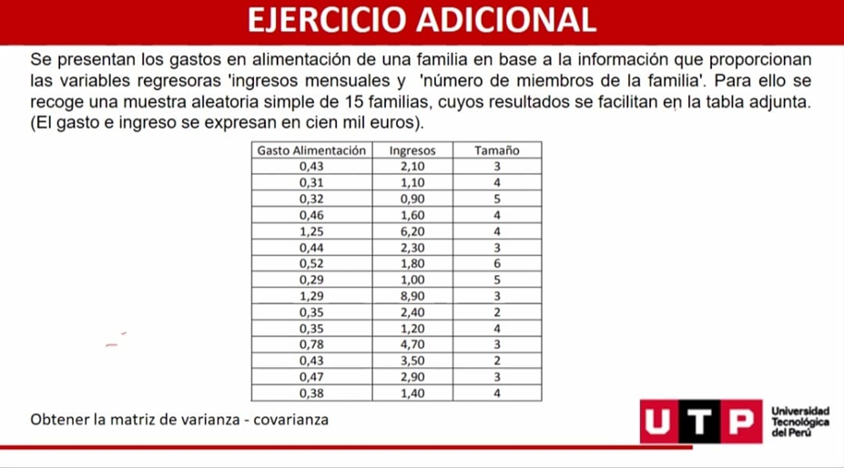

# Ejercicios

## Ejercicio 1

Se ha reunido la siguiente información de una muestra aleatoria de arrendadores de departamentos en una ciudad. Se intenta predecir la renta (en dólares por mes) con base en el tamaño del departamento (número de habitaciones) y la distancia al centro de la ciudad (en millas).

1. Determinar la ecuación de regresión estimada
2. Interpretar cada uno de los Teficientes
Tamaño Distancia

360, 1000, 450, 525, 350, 300

2, 6, 3, 4, 2, 1, 1, 1, 2, 3, 10, 4

$$ \hat{Y} = \hat{\beta_0} + \hat{\beta_1}X_1 + \hat{\beta_2}X_2 $$

**Solución:**

- $\beta_0$: La renta esperada (promedio), cuando el tamaño del departamento y la distancia al centro de la ciudad toman el valor de cero será de 96.481$
- $\beta_1$: Por **cada incremento** de una habitación, la renta esperada (promedio) se **incrementará** en 136.485$ manteniendo constante la distancia al centro de la ciudad.
- $\beta_2$: Por **cada incremento** de una unidad de distancia al centro de la ciudad, la renta esperada (promedio) **disminuirá** en -2,401$ manteniendo constante el número de habitación

## Ejercicio 2

| Número de  autos vendidos | Número de comerciales televisados | Número de vendedores |        |        |          |         |         |
| ------------------------- | --------------------------------- | -------------------- | ------ | ------ | -------- | ------- | ------- |
| Y                         | $X_1$                             | $X_2$                | $X_1Y$ | $X_2Y$ | $X_1X_2$ | $X_1^2$ | $X_2^2$ |
|                           |                                   |                      |        |        |          |         |         |
| 30                        | 3                                 | 2                    | 90     | 60     | 6        | 9       | 4       |
| 50                        | 5                                 | 4                    | 250    | 200    | 20       | 25      | 16      |
| 40                        | 2                                 | 3                    | 80     | 120    | 6        | 4       | 9       |
| 25                        | 6                                 | 2                    | 150    | 50     | 12       | 36      | 4       |
| 30                        | 4                                 | 5                    | 120    | 150    | 20       | 16      | 25      |
| 40                        | 7                                 | 6                    | 280    | 240    | 42       | 49      | 36      |
| 40                        | 7                                 | 6                    | 280    | 240    | 42       | 49      | 36      |
|                           |                                   |                      |        |        |          |         |         |
| 215                       | 27                                | 22                   | 970    | 820    | 106      | 139     | 94      |

1. Determinar la ecuación de regresión estimada
2. Interpretar cada uno de los coeficientes

## Ejercicio 3

| Meses     | Número de autos vendidos | Número de comerciales televisados | Número de vendedores |        |        |          |         |         |
| --------- | ------------------------ | --------------------------------- | -------------------- | ------ | ------ | -------- | ------- | ------- |
| $N$       | $Y$                      | $X_1$                             | $X_2$                | $X_1Y$ | $X_2Y$ | $X_1X_2$ | $X_1^2$ | $X_2^2$ |
|           |                          |                                   |                      |        |        |          |         |         |
| 1         | 30                       | 3                                 | 2                    | 90     | 60     | 6        | 9       | 4       |
| 2         | 50                       | 5                                 | 4                    | 250    | 200    | 20       | 25      | 16      |
| 3         | 40                       | 2                                 | 3                    | 80     | 120    | 6        | 4       | 9       |
| 4         | 25                       | 6                                 | 2                    | 150    | 50     | 12       | 36      | 4       |
| 5         | 30                       | 4                                 | 5                    | 120    | 150    | 20       | 16      | 25      |
| 6         | 40                       | 7                                 | 6                    | 280    | 240    | 42       | 49      | 36      |
|           |                          |                                   |                      |        |        |          |         |
| **Sumas** | 215                      | 27                                | 22                   | 970    | 820    | 106      | 139     | 94      |

$$ \sum Y = ? $$

$$ \sum X_1 = ? $$

$$ \sum X_2 = ? $$

$$ \sum X_1Y = ? $$

$$ \sum X_2Y = ? $$

$$ \sum X_1X_2 = ? $$

$$ \sum X_1^2 = ? $$

$$ \sum X_2^2 = ? $$

1. Determinar la ecuación de regresión estimada
2. Interpretar cada uno de los coeficientes

**Solución:**

- Hallamos las sumatorias correspondientes:

1. $$ \sum Y = 215 $$

2. $$ \sum X_1 = 27 $$

3. $$ \sum X_2 = 22 $$

4. $$ \sum X_1Y = 970 $$

5. $$ \sum X_2Y = 820 $$

6. $$ \sum X_1X_2 = 106 $$

7. $$ \sum X_1^2 = 139 $$

8. $$ \sum X_2^2 = 94 $$

- Reemplazando en las ecuaciones normales

$$ \begin{align*}
215 & = 6{\beta_0} + 27{\beta_1} + 22{\beta_2} \\
970 & = {\beta_0} \cdot 27 + {\beta_1} \cdot 139 + {\beta_2} \cdot 106 \\
820 & = {\beta_0} \cdot 22 + {\beta_1} \cdot 106 + {\beta_2} \cdot 94
\end{align*}
 $$

- Resolviendo el sistema de ecuaciones:

- Usando la calculadora de matrices:

$$ \begin{bmatrix} 6 & 27 & 22 \\ 27 & 139 & 106 \\ 22 & 106 & 94 \end{bmatrix} \begin{bmatrix} {\beta_0} \\ {\beta_1} \\ {\beta_2} \end{bmatrix} = \begin{bmatrix} 215 \\ 970 \\ 820 \end{bmatrix} $$

- Obtenemos:

$$ \begin{bmatrix} 6\beta_0+27\beta_1+22\beta_2=215 \\ 27\beta_0+139\beta_1+106\beta_2=970 \\ 22\beta_0+106b+94\beta_2=820 \end{bmatrix} $$

$$ \begin{align*}
  \beta_0 & = \frac{16455}{553} \\
  \beta_1 & = -\frac{565}{553} \\
  \beta_2 & = \frac{230}{79}
\end{align*} $$

$$ \begin{align*} {\beta_0} & = 29.75587703 \\ {\beta_1} & = 2.911392405 \\ {\beta_2} & = -1.021699819 \end{align*} $$

- Reemplazando en la ecuación de regresión estimada:

$$ \hat{Y} = 29.75587703 + 2.911392405X_1 - 1.021699819X_2 $$

- Interpretación de los coeficientes del ejercicio 3:

Ahora, interpretemos los coeficientes de la regresión estimada:

1. $\beta_0$: El número de autos vendidos esperado (promedio), cuando el número de comerciales televisados y el número de vendedores toman el valor de cero será de 29.75587703
2. $\beta_1$: Por **cada incremento** de un comercial televisado, el número de autos vendidos esperado (promedio) se **incrementará** en 2.911392405 manteniendo constante el número de vendedores.
3. $\beta_2$: Por **cada incremento** de un vendedor, el número de autos vendidos esperado (promedio) **disminuirá** en -1.021699819 manteniendo constante el número de comerciales televisados.

## Ejercicio 4

Se presentan los gastos en alimentación de una familia en base a la información que proporcionan las variables regresoras 'ingresos mensuales y 'número de miembros de la familia'. Para ello se recoge una muestra aleatoria simple de 15 familias, cuyos resultados se facilitan en la tabla adjunta. (El gasto e ingreso se expresan en cien mil euros).

| Gasto en alimentación | Ingresos mensuales | Número de miembros de la familia |
| --------------------- | ------------------ | -------------------------------- |
| 0.43                  | 2.10               | 3                                |
| 0.31                  | 1.10               | 4                                |
| 0.32                  | 0.90               | 5                                |
| 0.46                  | 1.60               | 4                                |
| 1.25                  | 6.20               | 4                                |
| 0.44                  | 2.30               | 3                                |
| 0.52                  | 1.80               | 6                                |
| 0.29                  | 1.00               | 5                                |
| 1.29                  | 8.90               | 3                                |
| 0.35                  | 2.40               | 2                                |
| 0.35                  | 1.20               | 4                                |
| 0.78                  | 4.70               | 3                                |
| 0.43                  | 3.50               | 2                                |
| 0.47                  | 2.90               | 3                                |
| 0.38                  | 1.40               | 4                                |

1. Obtener la matriz de varianza - covarianza.

**Datos del problema:**

- $N = 15$
- $k = 2$
- Gasto de Alimentación es la variable dependiente
- Ingresos Mensuales y Número de miembros de la familia son las variables independientes

**Solución:**

- Hallamos las sumatorias correspondientes recreando la tabla:

| Gasto en alimentación | Ingresos mensuales | Número de miembros de la familia | $X_1Y$ | $X_2Y$ | $X_1X_2$ | $X_1^2$ | $X_2^2$ |
| --------------------- | ------------------ | -------------------------------- | ------ | ------ | -------- | ------- | ------- |
| $Y$                   | $X_1$              | $X_2$                            |        |        |          |         |         |
| 0.43                  | 2.10               | 3                                | 1.29   | 6.30   | 6.30     | 4.41    | 9       |
| 0.31                  | 1.10               | 4                                | 1.24   | 4.40   | 4.40     | 0.96    | 16      | 0 |
| 0.32                  | 0.90               | 5                                | 1.60   | 4.50   | 4.50     | 0.81    | 25      |
| 0.46                  | 1.60               | 4                                | 1.84   | 6.40   | 6.40     | 2.56    | 16      |
| 1.25                  | 6.20               | 4                                | 5.00   | 4.00   | 4.00     | 38.44   | 16      |
| 0.44                  | 2.30               | 3                                | 1.32   | 6.90   | 6.90     | 4.84    | 9       |
| 0.52                  | 1.80               | 6                                | 3.12   | 10.80  | 10.80    | 3.24    | 36      |
| 0.29                  | 1.00               | 5                                | 1.45   | 5.00   | 5.00     | 0.81    | 25      |
| 1.29                  | 8.90               | 3                                | 3.87   | 26.70  | 26.70    | 16.64   | 9       |
| 0.35                  | 2.40               | 2                                | 0.70   | 4.80   | 4.80     | 1.23    | 4       |
| 0.35                  | 1.20               | 4                                | 1.40   | 4.80   | 4.80     | 1.23    | 16      |
| 0.78                  | 4.70               | 3                                | 2.34   | 14.10  | 14.10    | 6.08    | 9       |
| 0.43                  | 3.50               | 2                                | 0.86   | 7.00   | 7.00     | 4.41    | 4       |
| 0.47                  | 2.90               | 3                                | 1.41   | 8.70   | 8.70     | 4.84    | 9       |
| 0.38                  | 1.40               | 4                                | 1.52   | 5.60   | 5.60     | 0.64    | 16      |

- De la tabla obtenemos:

$$ \sum Y = 6.85 $$

$$ \sum X_1 = 40.6 $$

$$ \sum X_2 = 55 $$

$$ \sum X_1Y = 30.92 $$

$$ \sum X_2Y = 131.2 $$

$$ \sum X_1X_2 = 131.2 $$

$$ \sum X_1^2 = 81.92 $$

$$ \sum X_2^2 = 225 $$

- Se deja en fracciones para evitar errores de redondeo

$$ \bar{Y} = \frac{6.85}{15} $$

$$ \bar{X_1} = \frac{40.6}{15} $$

$$ \bar{X_2} = \frac{55}{15} $$

- Para obtener la matriz, usamos las siguientes fórmulas:

$$ \sigma_y^2 = \frac{\sum_{i=1}^N Y_i}{N} - \bar{Y}^2 $$

$$ S_{YX_1} = \frac{\sum_{i=1}^N Y_iX_{1i}}{N} - \bar{Y}\bar{X_{1i}} $$

- De la misma manera para cada variable que se tenga del modelo de regresión lineal múltiple

- Reemplazando en las fórmulas:

$$ \sigma_y^2 = \frac{6.85}{15} - \left(\frac{6.85}{15}\right)^2 = \frac{22331}{90000} $$

$$ \sigma_{X_1}^2 = \frac{81.92}{15} - \left(\frac{40.6}{15}\right)^2 = -\frac{10489}{5625} $$

$$ \sigma_{X_2}^2 = \frac{225}{15} - \left(\frac{55}{15}\right)^2 = \frac{14}{9} $$

$$ S_{YX_1} = \frac{30.92}{15} - \left(\frac{6.85}{15}\right)\left(\frac{40.6}{15}\right) = \frac{18569}{22500} $$

$$ S_{YX_2} = \frac{131.2}{15} - \left(\frac{6.85}{15}\right)\left(\frac{55}{15}\right) = \frac{1273}{180}$$

$$ S_{X_1X_2} = \frac{131.2}{15} - \left(\frac{40.6}{15}\right)\left(\frac{55}{15}\right) = -\frac{53}{45}$$

- Obtenemos la matriz de varianza - covarianza:

$$ \begin{bmatrix} \sigma_y^2 & S_{YX_1} & S_{YX_2} \\ S_{YX_1} & \sigma_{X_1}^2 & S_{X_1X_2} \\ S_{YX_2} & S_{X_1X_2} & \sigma_{X_2}^2 \end{bmatrix} = \begin{bmatrix} \frac{22331}{90000} & \frac{18569}{22500} & \frac{1273}{180} \\ \frac{18569}{22500} & -\frac{10489}{5625} & -\frac{53}{45} \\ \frac{1273}{180} & -\frac{53}{45} & \frac{14}{9} \end{bmatrix} $$
