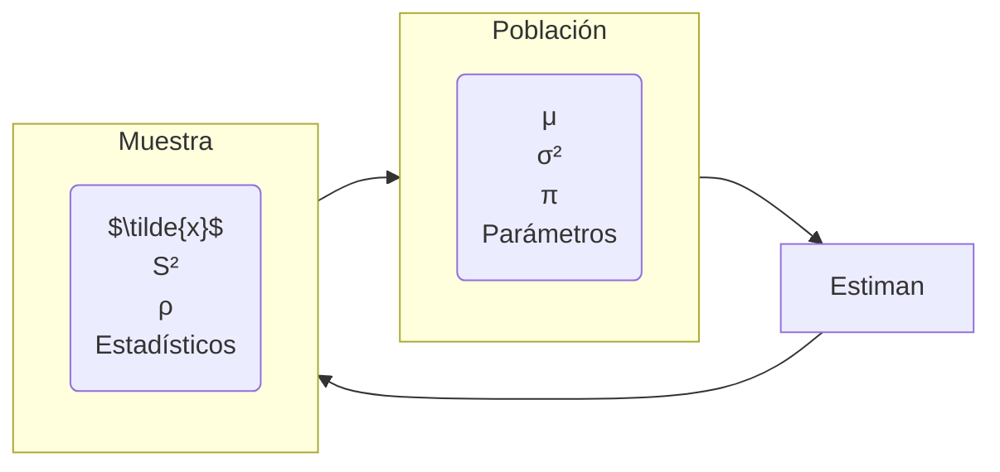
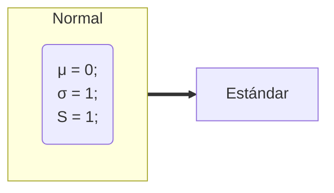
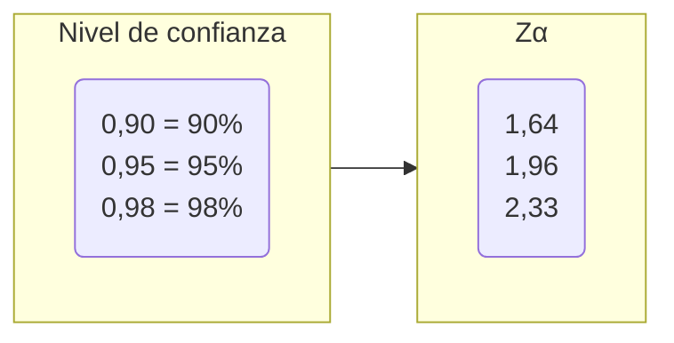
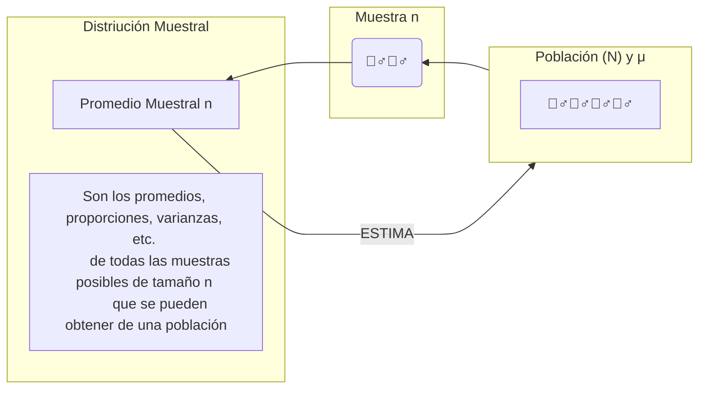

# Estadística Inferencial 🧠

Inferir parámetros estadísticos de la población, a partir de los estadísticos de una muestra

## 0. Lista de definiciones

### Teorema de límite central

El teorema del límite central establece que, si se toman todas las muestras posibles de tamaño $n de una población, la distribución de las medias muestrales será una distribución normal con media igual a la media poblacional y desviación estándar igual a la desviación estándar poblacional dividida por la raíz cuadrada del tamaño de la muestra.

**e.g.** Vamos a ver la estatura de personas menores de 30 años, estatura entre 30-50 y mayores de 50. Al hacer la gráfica los jóvenes tiendes a ir a la **izquierda**, los de 30-50 al **centro** y los mayores de 50 a la **derecha**. Al hacer la gráfica de la media de cada grupo, se ve que se distribuyen normalmente.

Cuanto más datos (información) halla, sea la distribución que sea **todos tienden a centro, a tener la curva normal**.

### Varianza

$S^2$

Es una medida de dispersión para variables de razón o intervalo. Es la media aritmética de los cuadrados de las desviaciones de cada observación respecto a la media.

**Cuando la varianza es 0, todos los datos son iguales al promedio.**

### Desviación Estándar

$\sqrt{S^2} = S$

Es una medida de dispersión para variables de razón o intervalo. Es la raíz cuadrada de la varianza.

### Probabilidad de complemento

$$ P(A^c) = 1 - P(A) $$

Esta probabilidad se usa cuando se quiere calcular la probabilidad de que un evento no ocurra. Se calcula restando la probabilidad de que ocurra el evento a 1.

### Población normal

Una población normal es aquella que tiene una distribución normal.

Se sabe que es normal cuando la media es cero y la desviación estándar es uno.

$$ \mu = 0 $$
$$ \sigma = 1 $$

### Curva normal

Es una curva simétrica, en forma de campana, que se obtiene al graficar una distribución normal.

## 1. Conceptos Básicos

### 1.1. Definición

Clasificación de la estadística teoría para **inferir o estimar** las leyes de una población, partiendo de un **análisis**.

### 1.2. Población

Conjunto de entes.

Unidades de observación, cuyas características observables se van a estudiar.

Se define en términos de su contenido, extensión y tiempo. Las medidas estadísticas que se obtienen se denominan **parámetros**.

### 1.3. Muestra

Es un subconjunto de la población seleccionada con el fin de obtener información acerca de la población de la que proviene.

La muestra debe ser **representativa** y **aleatoria**. Sus medidas estadísticas se denominan **estadísticos** o **estadígrafos**

### 1.4. Parámetro

Característica numérica que describe una variable observada en la **población**.

### 1.5. Estadístico

Característica numérica que describe una variable observada en la **muestra**.

### 1.6. Variable

Es una característica, cualidad de un objeto de estudio y tiende a medido.

### 1.7. Observación (datos)

Valores que toma la característica ([variable](#16-variable)) observada en cada elemento.

### 1.8. Unidad de análisis

Objeto indivisible que será estudiado sobre una población.

## Relación Población-Muestra

### Para la población

- &mu; = Media o promedio poblacional
- &sigma;² = Varianza poblacional
- &sigma; = Desviación estándar poblacional
- &pi; = Proporción poblacional (porcentaje)

### Para la muestra

- $\tilde{x}$ = Media o promedio muestral
- S² = Varianza muestral
- S = Desviación estándar muestral
- &rho; = Proporción de la muestra (porcentaje)

### Nota: Si S² = 0, entonces todos los datos son iguales al promedio

## 2. Muestreo

Herramienta de la investigación científica, cuya función básica es **determinar qué parte de una población debe examinarse**, con la finalidad de hacer inferencias.

### 2.1 Muestreo Probabilístico (Aleatorio)

- Todos los elementos tienen la misma posibilidad de ser elegidos (probabilidad conocida y equitativa)
- Nos aseguran la representatividad de la muestra
- Se puede sacar conclusiones sobre la población (inferencia estadística)ro
- Alto costo de tiempo y dinero (criterios estadísticos)

### 2.2. Muestreo no Probabilístico (No Aleatorio)

- No todos los elementos tienen la misma posibilidad de ser elegidos
- Son muestras que seguramente **esconden sesgos** que sea lo más representativa posible
- No se puede sacar conclusiones (extrapolar) sobre la población (inferencia estadística)
- Bajo costo de tiempo y dinero (criterios no estadísticos)

## 3. Tipo de muestreo

### 3.1. Probabilístico

- Aleatorio simple
- Aleatorio sistemático
- Aleatorio estratificado
- Aleatorio por conglomerados

### 3.2. No Probabilístico

- Por conveniencia o intencional
- Por cuota
- Bola de nieve
- Discrecional

#### 3.1.1. Muestreo Aleatorio Simple

Todos los elementos de la población tienen la misma probabilidad de ser elegidos, es conocida y equitativa.

- Dificultad al elegir todos los números aleatorios si la población es muy grande, alto costo
- Necesita una lista completa de los elementos de la población (marco muestral)
- Es obligatorio un marco muestral

#### 3.1.2 Muestreo Sistemático

Se aplica cuando la población es bastante irregular respecto al carácter que se estudia y se desea que en la muestra se refleje toda est variabilidad.

- Fácil de seleccionar en campo o durante un operativo
- En el [MAS](#311-muestreo-aleatorio-simple) primero se calcula primero el tamaño de la muestra y luego se selecciona el intervalo de selección
- A veces se usa un intervalo

#### 3.1.3. Muestreo Estratificado

- Se estratifica la población según ciertas variables de interés
- Cada estrato homogéneos en su interior y diferentes entre sí en propiedades y tamaño
- Los estratos más grandes tienen mayor probabilidad de ser elegidos

#### 3.1.4. Muestreo por Conglomerados

Técnica que aprovecha la existencia de grupos o conglomerados naturales en la población. Este muestreo se utiliza cuando se trata de obtener una muestra al azar de una población que está dispersa geográficamente.

- Los conglomerados son homogéneos en su interior y diferentes entre sí en propiedades y tamaño
- Se seleccionan los conglomerados y luego se seleccionan los elementos de cada conglomerado
- Se usa cuando la población es muy grande y dispersa

#### 3.2.1 Muestreo por conveniencia

Comúnmente usada. Consiste en seleccionar una muestra de la población por el hecho de que sea accesible, implica un bajo coste operativo y bajo costo en el muestreo

**e.g.** Seleccionar a los primeros 100 estudiantes que lleguen a la universidad

#### 3.2.2 Muestreo por cuota

Es la versión **no probabilística** del muestreo estratificado.

##### Consiste en tres fases

1. Encontrar los grupos: Dividir la población en grupos o estratos según [variable](#16-variable) de interés
2. Fijar tamaño de las cuotas: Se fijan una "cuotas" que consisten en un número de individuos a encuestas para cada uno de estos grupos.
3. Seleccionar los individuos y comprobar las cuotas: Se buscan a los individuos (cuotas) de manera **no aleatoria**, puede ser por un muestreo por conveniencia.

#### 3.2.3 Muestreo por bola de nieve

Se localiza a algunos individuos, los cuales conducen a otros y estos a otros y así sucesivamente. Hasta conseguir que se **sature** la información.

##### Se emplea para poblaciones ocultas o de difícil acceso

#### 3.2.4 Muestreo discrecional

A criterio del investigador los elementos son elegidos sobre lo que él cree que puede aportar al estudio o investigación

## 4. Tablas estadísticas

### 4.1. Tabla Distribución Normal (Tabla Z)

#### Problema a)

$P(Z \le -2,53)$

- Buscar en la tabla el valor de -2,5 en la columna de la izquierda y 0,03 en la fila superior
- El valor de la tabla es 0,0057
- P(Z &le; -2,53) = 0,0057

#### Problema b)

$P(Z \ge 1,32)$

- No puede ser mayor
- Usamos **probabilidad de complemento**

$$ 1 - P(Z \le 1,32) $$

- Buscar en la tabla el valor de 1,3 en la columna de la izquierda y 0,02 en la fila superior
- El valor de la tabla es 0,4032

#### Problema c)

$P(-2,53 \le 3,01)$

- Se dividen las probabilidades en dos

$$ P(Z \le 3,01) - P(Z \le -2,53) $$

- **La probabilidad mayor a Z pasó a restar**
- Buscar en la tabla el valor de 3,0 en la columna de la izquierda y 0,01 en la fila superior
- El valor de la tabla es 0,4987
- Buscar en la tabla el valor de -2,5 en la columna de la izquierda y 0,03 en la fila superior
- El valor de la tabla es 0,0057

$$ P(Z \le 3,01) - P(Z \le -2,53) $$
$$ 0,4987 - 0,0057 $$
$$ 0,4930 $$

#### Ejercicio: Calcule la probabilidad de que X sea menor que 6

$P(X < 6)$

$\mu = 8$
$\sigma = 1,5$

### Fórmula de Proceso de Estandarización 🔋

$$ Z = \frac{X - \mu}{\sigma} $$

### Los valores de Z van de -3,99 a 3,99 ❗

- Aplican las mismas reglas de la tabla de distribución normal

$$ Z = \frac{6 - 8}{1,5} $$
$$ Z = \frac{-2}{1,5} $$
$$ Z = -1,33 $$

- Buscar en la tabla el valor de -1,3 en la columna de la izquierda y 0,03 en la fila superior
- El valor de la tabla es 0,0918
  $$ P(Z < 6) = 0,0918 $$

## 5. Cálculo de tamaño de muestra 🔋

Determinar el tamaño de la muestra que se va a seleccionar es un paso importante en cualquier estudio de investigación de mercados, se debe justificar convenientemente de acuerdo al planteamiento del problema, la población, los objetivos y el propósito del estudio.

**Se definen los siguientes factores:**

### a) Nivel de confianza (1 - &alpha;)

Probabilidad deseada de que el parámetro a estimar se encuentre dentro de un margen esperado , los valores estadísticos son:

#### Se elige nivel de confianza

### b) Margen de error deseado (d)

Error en la estimación que como máximo se espera obtener

### c) Proporción estimada (p)

Proporción estimada del éxito de la variable que se desea medir

### 5.1. Cálculo del tamaño de muestra conociendo la población

$$ n = \frac{N \cdot Z\alpha \cdot p \cdot q}{d^2 \cdot (N - 1) + Z\alpha^2 \cdot p \cdot q}$$

### 5.2. Cálculo del tamaño de muestra sin conocer la población

$$ n = \frac{Z\alpha^2 \cdot p \cdot q}{d^2} $$

### 5.3. Cálculo del tamaño de muestra para una media cuando se conoce la población

$$ n = \frac{Z\alpha^2 \cdot \sigma^2 \cdot N}{E^2(N - 1) + Z\alpha^2 \cdot \sigma^2} $$

### 5.4. Cálculo del tamaño de muestra para una media cuando se desconoce la población

$$ n = \frac{Z\alpha^2 \cdot \sigma^2}{E^2} $$

#### Variables para el cálculo de tamaño de muestra

- N = Tamaño de la población
- Z&alpha; = Nivel de confianza
- p = Probabilidad de éxito
- q = Probabilidad de fracaso
- d = Error máximo permisible en la estimación (Margen de error)

## 6. Distribución Muestral

**Distribución**: Conjunto de datos la manera en la que están presentados varían según la distribución.

SI ESTUDIO LA MEDIA (&mu;) DE LA POBLACIÓN: [PARÁMETRO](#14-parámetro)

SI ESTUDIO LA MEDIA ($\tilde{x}$)DE LA MUESTRA: [ESTADÍSTICO o ESTIMADOR](#15-estadístico)

- Teoria del muestreo estudia las **RELACIONES** entre la **POBLACIÓN** y las **MUESTRAS** extraídas de la misma
- Permite **ESTIMAR** cantidades **DESCONOCIDAS** de la población como la media poblacional, la varianza,etc. frecuentemente llamadas **PARÁMETROS POBLACIONALES** a partir de las correspondientes cantidades muestrales como son la media, la varianza y otros **estadísticos muestrales** o brevemente llamados **estadísticos**.
- La teoría de muestreo es útil para determinar por ejemplo: el aplicar un nuevo suero para el tratamiento de una enfermedad, o decidir si un proceso de producción es mejor que otro. Estas deciciones envuelven a los llamados **ensayos e hipótesis de significación**.
- En general, a todo lo mencionado anteriormente se le conoce como **INFERENCIA ESTADÍSTICA**.
- De la población se extraen muestras de tamaño n, se calcula el estadístico de interés y se construye una distribución muestral de ese estadístico.
-La muestra puede tomar diferentes valores, pero el estadístico de interés es el mismo. Entonces es mejor hacer que varíen lo menos posible el tamaño de muestra.

Véase también [Relación población-muestra](#relación-población-muestra)

**e.g.** Tenemos a la población de 2500 empleados y varias de muestras cada una de 30.

- Población

$$ N = 2500 $$

| Empleado | Salario |
| -------- | ------- |
| 1        | $       |
| 2        | $       |
| 3        | $       |
| ...      | ...     |
| 2500     | $       |

$$ \mu = \$1200 $$

- Muestra: $n_{1}$

$$ n_{1} = 30 $$

| Empleado | Salario |
| -------- | ------- |
| 1        | $       |
| 2        | $       |
| 3        | $       |
| ...      | ...     |
| 30       | $       |

$$ \tilde{x}_{1} = \$13334 $$

- Muestra: $n_{2}$

$$ n_{2} = 30 $$

| Empleado | Salario |
| -------- | ------- |
| 1        | $       |
| 2        | $       |
| 3        | $       |
| ...      | ...     |
| 30       | $       |

$$ \tilde{x}_{2} = \$11484 $$

- Muestra: $n_{3}$

$$ n_{k} = 30 $$

| Empleado | Salario |
| -------- | ------- |
| 1        | $       |
| 2        | $       |
| 3        | $       |
| ...      | ...     |
| 30       | $       |

$$ \tilde{x}_{k} = \$12500$$

- Donde $k = 500$
- Tabla de valores de 500 muestras, de tamaño $n=500$

| No. de muestras | Media muestral ($\tilde{x}$) |
| --------------- | ---------------------------- |
| 1               | $\tilde{x}_{1} = \$13354$    |
| 2               | $\tilde{x}_{2} = \$11484$    |
| 3               | $\tilde{x}_{3} = \$11138$    |
| ...             | ...                          |
| 500             | $\tilde{x}_{500} = \$12500$  |

$$ \frac{\sum\tilde{x}_{i}}{500} \approx \mu  $$

### Si en vez de 500 muestras tomamos todas las muestras posibles, obtendríamos

$$ E(\tilde{x}) = \mu  $$

### Propiedades de la distribución muestral de $\tilde{x}$

Donde la media y la desviación estándar:

#### La media (&mu;) y la [desviación típica](#desviación-estándar) (&sigma;) de la **población**

#### La media (&mu;$_{\tilde{x}}$) y la [desviación típica](#desviación-estándar) (&sigma;$_{\tilde{x}}$) de la **distribución muestral**

Casos según la distribución de la población: Donde $X$ son los datos.

### 6.1. Distribución Estándar de la Muestra X &sim; n(&mu;, $\frac{\sigma}{\sqrt{n}}$) y Población X &sim; N(&mu;, &sigma;²)

#### Caso 1: Población con Distribución **[NORMAL](#curva-normal)**: $X \sim N(\mu, \sigma^2)$

Si la muestra aleatoria $X_{1}, ..., X_{n}$ Tiene distribución normal con **media &mu;** y **desviación típica &sigma;**:

Para cualquier tamaño de muestra ($n$):

La media muestral ($\tilde{x}$) también tiene una distribución normal con media $\mu_{\tilde{x}} = \mu$ y [desviación típica](#desviación-estándar): $\sigma_{\tilde{x}} = \frac{\sigma}{\sqrt{n}}$

**Notación estadística** -> Si: $X \sim n(\mu, \frac{\sigma}{\sqrt{n}}) \rarr X \sim N(\mu, \frac{\sigma}{\sqrt{n}})$

#### Caso 2: Población con distribución **NO NORMAL**: $X \sim ??(\mu, \sigma^2)$

**Teorema del [límite central](#teorema-de-límite-central)**

Si la muestra seleccionada tiene un tamaño **MAYOR O IGUAL** a **30**, sea cual sea la forma de la distribución de la población **(SEA NORMAL O NO)**, las medias de todas las muestras seleccionadas de la población tendrán una distribución normal.

**Recapitulando:**

### a) Valor esperado

Para el muestreo aleatorio simple. Donde $E$ es el **valor esperado** $E(\tilde{x}) = \mu$

**e.g.** Sabemos que &mu; = \$12,2111, entonces E($\tilde{x}$) = \$12,2111

### b) Desviación Estándar

#### Población finita

$$ \sigma_{\tilde{x}} = \sqrt{\frac{N - n}{N - 1}} \cdot (\frac{\sigma^2}{n}) $$

#### Población infinita

Si no dan datos de la población, entonces se asume que es infinita.

$$ \sigma_{\tilde{x}} = \frac{\sigma}{\sqrt{n}} $$

### Si la población finita pero $\frac{n}{N} \le 0,05$ se usa la fómula de la [Población infinita](#población-infinita)

**e.g.** Sabemos que $\sigma = \$1,500$, entonces $\sigma_{\tilde{x}} = \$1,500$

$\sigma = 4480.42$
$N = 2500$
$n = 30$

$$ \frac{n}{N} = 30/2500 = 0,012 $$

$$ \sigma\_{\tilde{x}} = \frac{4480.42}{\sqrt{30}} = 818.01 $$

### c) Forma de la distribución (población &equiv; p)

#### Población desconocida

La distribución de la media de la muestra $\tilde{x}$ se puede aproximar con una distribución normal de probabilidades cuando el tamao de la muestra es grande

$$ n \ge 30 $$

#### [Población normal](#población-normal), sin importar el tamaño de la muestra

Ls distribución muestral de $\tilde{x}$ es **[NORMAL](#curva-normal)** para cualquier tamaño de la muestra.

### Si $n \ge 30$, entonces $\tilde{x}$ se distribuye normalmente

### Si $n < 30$, entonces $\tilde{x}$ se distribuye normalmente _si la población es normal_

### Con una [M.A.S](#311-muestreo-aleatorio-simple) de $n \ge 30$ y aplicando el [Teorema del Límite Central](#teorema-de-límite-central), la distribución muestral de $\tilde{x}$ es normal con &mu; y &sigma;$_{\tilde{x}} = \frac{\sigma}{\sqrt{n}}$

Véase el ejemplo en [Teorema del Límite Central](#teorema-de-límite-central)

![distribucion-muestral-de-x][teorema-del-limite-central]

#### Supóngase que son extraídas de una [Población Infinita](#población-infinita) todas las posibles [muestras](#13-muestra) **sin reemplazo** de tamaño $n$

**Si se denota:**

Vésase [distribución estándar](#fórmula-de-proceso-de-estandarización-🔋) de la [muestra](#la-media-μ-y-la-desviación-típica-σ-de-la-distribución-muestral) y [población](#la-media-μ-y-la-desviación-típica-σ-de-la-población)

- La [distribución muestral](#6-distribución-muestral) de las medias cumplen la siguiente igualdad:

- La media de la muestra va a ser igual a la media de la población cuando más muestras se tenga:

$$ \mu_{\tilde{x}} = \mu $$

- La desviación estándar de la muestra
- n = cantidad de elementos de la muestra

$$ \sigma_{\tilde{x}} = \frac{\sigma}{\sqrt{n}} $$

## 7. Prueba de normalidad

Para conseguir si la distribución de datos se ajusta a una distribución normal teórica.

### 7.1. Prueba de Kolmogorov-Smirnov

1. $H_{0}$: Los datos siguen una [D.N.E](#caso-1-población-con-distribución-normal)
2. $H_{1}$: Los datos [**NO** siguen una D.N.E](#caso-2-población-con-distribución-no-normal), no tienen [curva normal](#curva-normal)

#### Errores conocidos (véase [Nivel de confianza](#se-elige-nivel-de-confianza))

$$ \alpha = \{0,01; 0,05; 0,1\}$$

### 7.2. Estadístico de Prueba

Arsenal matemático para determinar si los datos tienen [curva normal](#curva-normal) o **NO**.

$$ D = \displaystyle \sup_{1 \le i \le n}|\hat{F}_{n}(x_{i}) - F_{0}(x_{i})| $$

Donde:

- **$Xi$**: Es el i-ésimo valor observado en la muestra (Cuyos valores se han ordenado previamente de mayor menor)
- **$F_{n}(x_{i})$**: Es un estimador de la probabilidad de observar valores menores o iguales a $x_{i}$
- **$F_{o}(x_{i})$**: Es la probabilidad de observar valores menores o iguales que $x_{i}$ cuando $H_{0}$ es cierta

Así pues $D$ es la mayor diferencia absoluta entre la frecuencia acumulada observada $F_{o} (x_{i})$ y la frecuencia acumulada teórica $F_{o}(x_{i})$ obtenina a partir de la probabilidad que se especifica como Hipótesis Nula.

Para efectos prácticos:

$$ D^{+} = \max_{1 \le i \le n}\{ \frac{i}{n} - F_{0}(x_{i}) \},  D^{-} = \max_{1 \le i \le n}\{ F_{0}(x_{i}) - \frac{i - 1}{n} \}$$

Por tanto, a partir de estos valores $D = \max \{D^+, D^-\}$

### 7.3. Por tanto el criterio para rechazar o aceptar la prueba de hipótesis es

Si $D \le D_{\alpha} \rArr Aceptar H_{0}$

Si $D > D_{\alpha} \rArr Rechazar H_{0}$

Donde $D_{a} = \frac{C_{\alpha}}{k(n)}$

$C_{\alpha}$ podrá tomar los siguientes valores:

| C&alpha; |       | &alpha; |       |
| -------- | ----- | ------- | ----- |
| Modelo   | 0,1   | 0,5     | 0,9   |
| General  | 1,224 | 1,358   | 1,628 |
| Normal   | 0,819 | 0,895   | 1,035 |

$K(n)$ podrá tomar los siguientes valores:

Normal:

$$ K(n) = \sqrt{n} - 0,01 + \frac{0,85}{\sqrt{n}}$$

### Ejemplo N.1

Se tienen los ingresos de un grupo de 10 ingenieros egresado de la UTP, los cuales se presentan a continucación (en miles):

6,0; 2,3; 4,8; 5,6; 4,5;3,4;3,3;1,9;4,8;4,5

Probar que los sueldos se ajustan a una distribución normal con un nivel de significación de &alpha; = 0,05

**Solución:**

1. $H_{0}$: Los Sueldos siguen una [D.N.E](#caso-1-población-con-distribución-normal)
2. $H_{1}$: Los Sueldos [**NO** siguen una D.N.E](#caso-2-población-con-distribución-no-normal)

&alpha; = 0,05

$\tilde{x} = 4,1, S = 1,34$

A partir de la definición se construye la siguiente tabla: donde $\tilde{x} = 4,1, S = 1,34$

| Y   | Y-sorted | Orden | F   | Z      | Fo    | D+      | D-     |
| --- | -------- | ----- | --- | ------ | ----- | ------- | ------ |
| 6,0 | 1,9      | 1     | 0,1 | -1,628 | 0,051 | 0,049   | 0,051  |
| 2,3 | 2,3      | 2     | 0,2 | -1,332 | 0,091 | 0,109   | -0,009 |
| 4,8 | 3,3      | 3     | 0,3 | -0,592 | 0,276 | 0,024   | 0,076  |
| 5,6 | 3,4      | 4     | 0,4 | -0,518 | 0,302 | 0,098   | 0,002  |
| 4,5 | 4,5      | 5     | 0,5 | 0,296  | 0,616 | -0,116* | 0,216* |
| 3,4 | 4,5      | 6     | 0,6 | 0,296  | 0,616 | -0,016  | 0,116  |
| 3,3 | 4,8      | 7     | 0,7 | 0,518  | 0,698 | -0,002  | 0,098  |
| 1,9 | 4,8      | 8     | 0,8 | 0,518  | 0,698 | -0,102  | -0,002 |
| 4,8 | 5,6      | 9     | 0,9 | 1,11   | 0,867 | -0,033  | 0,067  |
| 4,5 | 6,0      | 10    | 1,0 | 1,406  | 0,920 | -0,080  | 0,020  |

> Si $D \le D_{\alpha}$, entonces se **acepta** $H_{0}$
>
> Si $D > D_{\alpha}$, entonces se **rechaza** $H_{0}$

Los cálculos para la primera fila será:

$$ Z = \frac{Y_{1}-x}{D} = \frac{1,9 - 4,1}{1,34} = -1,628 $$

- Buscar en la tabla el valor de -1,6 en la columna de la izquierda y 0,02 en la fila superior
- El valor de la tabla es 0,051

$$ Fo = P(Z =- 1,628) = 0,051 $$

$$ D_{1}+ = 0,1-0,051 = 0,049 $$

$$ D_{1}- = 0,051 - 0 = 0,051 $$

$$ D = \max \{D^+, D^-\} = \max \{0,049, 0,051\} = 0,216 $$

- Véase [Criterio para rechazar o aceptar la prueba de hipótesis](#73-por-tanto-el-criterio-para-rechazar-o-aceptar-la-prueba-de-hipótesis-es)

$$ D_{a} = \frac{0,895}{\sqrt{10}-0,01+\frac{0,85}{\sqrt{10}}} = \frac{0,895}{3,42} = 0,262 $$

**Conclusión:**

Como $D < D\alpha$, se puede concluir que los sueldos de los ingenieros de la UTP se ajustan a una [distribución Normal](#41-tabla-distribución-normal-tabla-z)

## Formulario

| Fórmula                   | Notación                                          | Descripción                                               |
| ------------------------- | ------------------------------------------------- | --------------------------------------------------------- |
| Estandarización           | [$Z = \frac{X - \mu}{\sigma}$][f_estandarización] | Proceso de estandarización                                |
| Cálculo tamaño de muestra | [Z&alpha;][f_calculo_de_muestra]                  | Nivel de confianza, margen de error y proporción estimada |

> [MARKDOWN BASIC SYNTAX GUIDE](https://www.markdownguide.org/basic-syntax/)

[f_estandarización]: #fórmula-de-proceso-de-estandarización-🔋
[f_calculo_de_muestra]: #5-cálculo-de-tamaño-de-muestra-🔋
[teorema-del-limite-central]: https://media.discordapp.net/attachments/1162449960910987294/1162449978405425324/image.png?ex=653bfae8&is=652985e8&hm=7bc9570ab55501b31f671a82cfc38d0e01b687d50151372caa43229a29309026&=&width=1043&height=545
